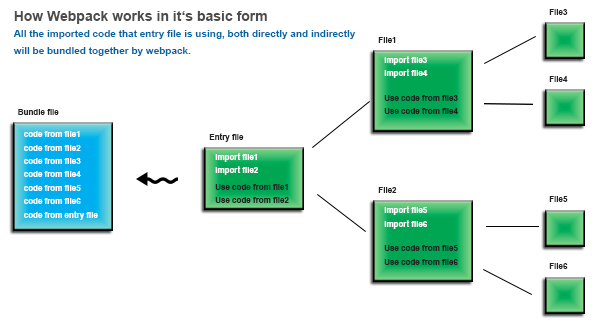

# webpack-tutorial
### A simple guide to using Webpack with different frameworks

As we all know Webpack is a JavaScript bundler, which means that it allows us to use multiple files on development environment to be later bundled to one or more javascript files (On production or dev-server). As I’ve said before in it’s mots basic form, Webpack is nothing more than a JavaScript bundler. 

##### from webpack docs:
>At its core, webpack is a static module bundler for modern JavaScript applications. When webpack processes your application, it recursively builds a dependency graph that includes every module your application needs, then packages all of those modules into one or more bundles."

I'll be using ES6 import and export syntax for importing modules. Import and Export statements are what we are using to connect different parts of the codes together. Each part of the code being exported or imported by webpack refered to as a module. So we are importing different modules that in the end will be bundled together as one or more files.

_If you don't know how to set a basic webpack environment, here is a [basic guide](basic-setting.md) for setting webpack envorenment on your machine_

[]


###### Lets see a simple example:
File: greetings.js
```javascript
export function getGreetings(name){
    return "Hello " + name + ", have a nice day"
}

export const unusedConstant = 'unused';
```

File: entry.js
```javascript
import {getGreetings} from 'greetings.js'
var greetIdan = getGreetings('Idan'); /* returns: Hello Idan, have a nice day */
```

Using webpack basic configuration:

```javascript
module.exports = {
  entry: './entry.js', /* Our entry file */
  output: {
    filename: 'bundle.js' /* The final results */
  }
};
```
The generated 'bundle.js' file will contain only the code we've imported from both files:
```javascript
function getGreetings(name){
    return "Hello " + name + ", have a nice day"
}
var greetIdan = getGreetings('Idan'); /* returns: Hello Idan, have a nice day */
```
### Loading more than just plain JavaScript files
Usually we'll want to use and import more than just plain JavaScript files in our projects, that is where **loaders** come in play. Like I've said before, Weback in it's core is just a plain JavaScript bundler, it can't import or understand other types of files. Using **loaders** we are able to tell webpack how to interpret and import other type of files.

##### from webpack docs:
#
>Loaders enable webpack to process more than just JavaScript files (webpack itself only understands JavaScript). They give you the ability to leverage webpack's bundling capabilities for all kinds of files by converting them to valid modules that webpack can process.
#
**In the following example, taken from webpack site, we are using a 'raw-loader' Loader to tell Webpack how to handle 'txt' files:**
```javascript
const path = require('path');

const config = {
  entry: './path/to/my/entry/file.js',
  output: {
    path: path.resolve(__dirname, 'dist'),
    filename: 'my-first-webpack.bundle.js'
  },
  module: {
    rules: [
      { test: /\.txt$/, use: 'raw-loader' }
    ]
  }
};

module.exports = config;
```

**We are using 'raw-loader' here to tell webpack to import 'txt' files as strings in our code.**

```javascript
  /* Loaders are added in the module section unser 'rules' */
  module: {
    rules: [
      { 
        /* The first property ('test') is where we usually 
           set the file extension ('txt') using regex. */ 
        test: /\.txt$/, 
        
        /* The second property ('use') is where we set the loader or loaders
          'raw-loader' in this case. */
        use: 'raw-loader' 
      }
    ]
  }
module.exports = config;
```
**Here is an example of 2 loaders used for 'css' files**

```javascript
{
  module: {
    rules: [
      {
        test: /\.css$/,
        use: [
          { loader: "style-loader" },
          { loader: "css-loader" }
        ]
      }
    ]
  }
}
```
The first loader is used to create an inline **style** element in the DOM for every 'css' file we import. The second loader 'css-loader' tells webpack how to interpret and load css files.

There are different types of loaders that can do different type of things, check webpack loaders page:
https://webpack.js.org/loaders/
